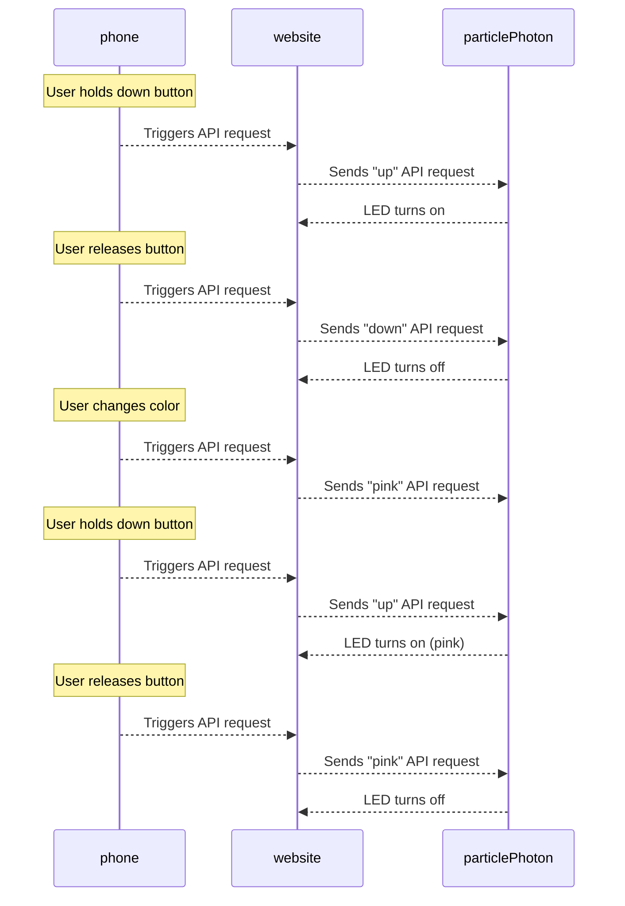

## Example Diagram for Interactions ###
Documenting with a diagram depicting the situation where the user sends a ping to the seat LED, and then changes the color to Pink and doing sending another ping.

